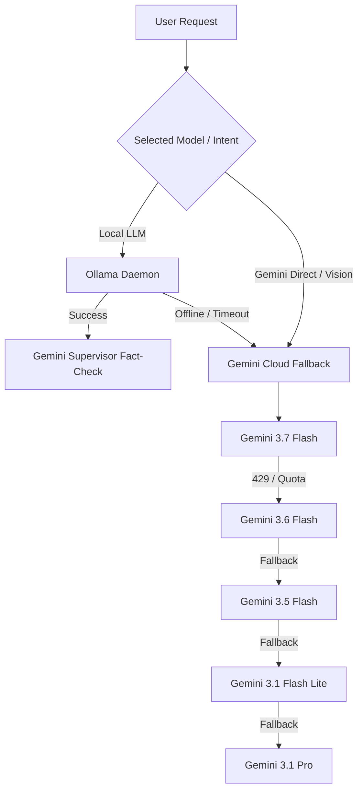

# ⚡ VEDAS AI — Multi-Modal Autonomous Voice Assistant & Neural Workstation

<div align="center">

[](https://github.com/Vfy123/VEDAS---AI---Voice-Assistant)
[](https://www.python.org/)
[](https://fastapi.tiangolo.com/)
[](https://ollama.com/)
[](https://ai.google.dev/)
[]()
[](LICENSE)
[]()

<p align="center">
  <strong>Vedas AI</strong> is an advanced, local-first multi-modal AI workstation, autonomous desktop command center, and voice assistant. Engineered with a hybrid intelligence pipeline combining private local LLMs via <strong>Ollama</strong> and cloud reasoning via <strong>Google Gemini</strong>, real-time web search, layout-aware PDF analysis, neural image generation, and system automation.
</p>

[Key Features](#-key-features) • [Architecture](#-project-architecture) • [Quick Start](#-quick-start) • [Local AI Setup](#-local-llm-setup-ollama) • [System Commands](#-voice--system-commands) • [API Reference](#-api-endpoints)

---

</div>

## ✨ Key Features

- 🧠 **Dual-Engine Hybrid Intelligence**: Run private, offline local LLMs (**LLaMA 3.2, Qwen 2.5, Phi-4**) via Ollama as your primary engine, with automated fallback to high-speed cloud intelligence (**Google Gemini 3.7 Flash / 3.6 / 3.5 / 3.1 Pro**).
- 🛡️ **Gemini Supervisor Fact-Checking**: Non-blocking real-time fact checker that verifies local Ollama outputs against Google Gemini to detect and correct inaccuracies without delaying responses.
- 🎙️ **Voice & Audio Interaction**: Real-time voice capture (STT) and text-to-speech audio feedback with interactive HUD hologram visualization.
- 📄 **Multimodal Document & Vision Studio**: 
  - **Layout-Aware PDF Extraction**: Preserves columns, tables, question numbers, and exercises for instant solving and answer key generation.
  - **Optical Vision Analysis**: Upload photos, diagrams, and screenshots for direct multimodal comprehension.
  - **Source Code & Text Parsing**: Inspect and summarize code files across dozens of programming languages.
- 🎨 **Neural Image Synthesis Studio**: Generate images on demand using **Flux** and **Turbo** models powered by Pollinations with 8+ visual style presets (*Cinematic, Anime, Cyberpunk, Photorealistic, 3D Render, Digital Art, Oil Painting, Pixel Art*) and custom aspect ratios.
- 💻 **OS & System Automation**: Control system volume, toggle mute, lock workstation, trigger shutdown/restart/sleep timers, create folders/files on the Desktop, and monitor live CPU & RAM telemetry.
- 🗂️ **Built-in Local File Explorer**: Browse directory structures, view files (<2MB), edit text and code files in real-time, create items, and delete files safely through the web interface.
- 🔍 **Live Web & Knowledge Engine**: Integrated internet searches via DuckDuckGo and encyclopedic summaries via Wikipedia.
- 💾 **Persistent Memory Bank**: Keep custom notes, manage multi-session conversation histories, and switch between system personas (*Master Vedas, Cyber Coder, Deep Thinker, Creative Muse, Sarcastic Genius*).
- 🔒 **Self-Contained HTTPS Security**: Automatically generates local SSL certificates (`certs/cert.pem`) to enable secure browser microphone permissions and encrypted local communication.

---

## 🏗️ Project Architecture

```
VEDAS---AI---Voice-Assistant/
├── RUN FILES/                   # Quick launcher scripts for all platforms
│   ├── Vedas Windows Run.bat    # Windows Batch launcher (Auto venv & Ollama check)
│   ├── Vedas Windows Run.ps1    # Windows PowerShell launcher
│   ├── Vedas Linux Run.sh       # Linux Bash launcher
│   └── Vedas Mac Run.command    # macOS command launcher
├── SERVER/                      # Backend application core
│   ├── vedas_server.py          # FastAPI backend, multimodal engine & system automation
│   └── run_vedas_web.py         # Orchestrator & automatic browser launcher
├── static/                      # Frontend client assets
│   ├── index.html               # Glassmorphic HUD & JARVIS-inspired web console
│   ├── css/                     # Styling, HUD scanlines, glow effects & responsive layout
│   └── js/                      # App logic, particle canvas, hologram audio visualizer & API sync
├── certs/                       # Auto-generated self-signed SSL certificates
├── memory/                      # Persistent storage for user notes & chat sessions (JSON)
├── uploads/                     # Storage for user-uploaded documents, PDFs, and images
├── .env.example                 # Environment variables configuration template
├── requirements.txt             # Python dependencies specification
├── VedasAI.spec                 # PyInstaller standalone executable build specification
├── LICENSE                      # MIT License
└── README.md                    # Project documentation
```

---

## 🚀 Quick Start

### 1. Clone the Repository
```bash
git clone https://github.com/Vfy123/VEDAS---AI---Voice-Assistant.git
cd VEDAS---AI---Voice-Assistant
```

### 2. Set Up a Virtual Environment
```bash
# Windows
python -m venv venv
venv\Scripts\activate

# Linux / macOS
python3 -m venv venv
source venv/bin/activate
```

### 3. Install Dependencies
```bash
pip install -r requirements.txt
```

### 4. Configure Environment Variables
Copy `.env.example` to `.env` and configure your settings:
```bash
# Windows (PowerShell / CMD)
copy .env.example .env

# Linux / macOS
cp .env.example .env
```

Open `.env` in any text editor and optionally add your Gemini API key:
```env
GEMINI_API_KEY=your_gemini_api_key_here
HOST=127.0.0.1
PORT=8000
```
*(Note: A fallback Gemini key is included in the server for quick testing, but using your own key from [Google AI Studio](https://aistudio.google.com/) is recommended for dedicated quota).*

---

### 5. Launch Vedas AI

#### Option A: Quick Launchers (Recommended)
- **Windows**: Double-click `RUN FILES/Vedas Windows Run.bat` (or execute `RUN FILES/Vedas Windows Run.ps1`)
- **Linux**: Execute `bash "RUN FILES/Vedas Linux Run.sh"`
- **macOS**: Execute `"RUN FILES/Vedas Mac Run.command"`

#### Option B: Terminal Command
```bash
python SERVER/run_vedas_web.py
```
*Or run the server directly:*
```bash
python SERVER/vedas_server.py
```

#### Option C: Access the Web Console
Open your web browser and navigate to:
```
https://127.0.0.1:8000
```
> [!NOTE]
> When accessing `https://127.0.0.1:8000` for the first time, your browser may display a self-signed certificate warning. Click **Advanced -> Proceed to 127.0.0.1 (unsafe)**. HTTPS is required to allow browser microphone access for voice input.

---

## 🔨 Building Standalone Executables (Windows, Linux, macOS)

To compile a single, zero-dependency standalone binary for your operating system:

```bash
python build_binaries.py
```

- **Windows**: Produces `dist/VedasAI.exe`
- **Linux**: Produces executable ELF binary `dist/VedasAI` (Run with `./dist/VedasAI`)
- **macOS**: Produces executable Mach-O binary `dist/VedasAI`

> [!TIP]
> **Automated GitHub Releases**: An automated CI/CD workflow is included (`.github/workflows/build-binaries.yml`) that compiles native binaries for Windows, Ubuntu Linux, and macOS in the cloud whenever you create a release tag (e.g. `git tag v1.0.0 && git push --tags`).

---

## 📦 Local LLM Setup (Ollama)

For 100% private, offline AI inference:

1. Download and install [Ollama](https://ollama.com/).
2. Pull the default recommended model:
   ```bash
   ollama run llama3.2
   ```
3. *(Optional)* Pull additional supported models:
   ```bash
   ollama pull qwen2.5:7b
   ollama pull phi4
   ollama pull llama3
   ```
4. Vedas AI will automatically detect running Ollama instances on `http://127.0.0.1:11434` and pre-load model weights into VRAM on startup for zero cold-start delay.

---

## ☁️ Cloud Intelligence & Fallback Chain

Vedas AI features an intelligent fallback chain for cloud models:



---

## 🗣️ Voice & System Commands

You can speak or type natural commands directly to Vedas AI:

| Category | Example Command | Action Performed |
| :--- | :--- | :--- |
| **Live Search** | `search for latest space missions` | Fetches real-time DuckDuckGo search results |
| **Knowledge** | `wikipedia Quantum Computing` | Fetches encyclopedic summaries from Wikipedia |
| **Audio Volume** | `set volume to 75` | Sets system master volume to 75% |
| **Audio Mute** | `mute` or `unmute` | Toggles system audio mute state |
| **Desktop Ops** | `create folder Project Alpha` | Creates a folder on your Desktop |
| **Desktop Ops** | `make a file notes.txt` | Creates a text file on your Desktop |
| **Workstation** | `lock computer` | Instantly locks the workstation session |
| **Power Control**| `shutdown` / `restart` / `sleep` | Initiates safe system power timer (5s countdown) |
| **Cancel Power** | `cancel shutdown` | Aborts a pending system shutdown |
| **Entertainment**| `tell me a joke` | Generates a programming or general joke |

---

## 🔌 API Endpoints

Vedas AI exposes a REST API via FastAPI:

| Endpoint | Method | Description |
| :--- | :---: | :--- |
| `/api/system/status` | `GET` | Live telemetry (CPU, RAM, platform time, Ollama status, active models) |
| `/api/ollama/start` | `POST` | Probes and auto-starts the local Ollama background daemon |
| `/api/chat` | `POST` | Core multimodal conversation endpoint (Ollama + Gemini + Supervisor) |
| `/api/generate-image` | `POST` | Synthesizes AI artwork via Flux / Turbo Pollinations engine |
| `/api/upload` | `POST` | Uploads and parses PDFs (layout-mode), code, text, and images |
| `/api/execute-code` | `POST` | Executes Python code safely with stdout/stderr capture |
| `/api/search` | `POST` | Direct web search and Wikipedia retrieval |
| `/api/system/command` | `POST` | Executes local OS actions (volume, power, folder creation) |
| `/api/files/browse` | `POST` | Interactive directory tree navigation |
| `/api/files/read` | `GET` | Reads local text/code files (<2MB) |
| `/api/files/write` | `POST` | Writes modifications directly to local files |
| `/api/files/create` | `POST` | Creates new files or directories |
| `/api/files/delete` | `DELETE`| Removes specified file or directory |
| `/api/memory` | `GET` | Retrieves saved persistent notes and session histories |
| `/api/memory/notes` | `POST` | Adds a persistent note to the memory bank |

---

## 🛠️ Tech Stack

- **Core Server**: [FastAPI](https://fastapi.tiangolo.com/), [Uvicorn](https://www.uvicorn.org/), [Pydantic](https://docs.pydantic.dev/)
- **AI Engines**: [Ollama](https://ollama.com/), [Google GenAI SDK](https://github.com/google-gemini/generative-ai-python), [Pollinations AI](https://pollinations.ai/)
- **Document & Multimodal**: [pypdf](https://pypdf.readthedocs.io/), [Pillow (PIL)](https://python-pillow.org/)
- **Search & Web**: [duckduckgo-search](https://pypi.org/project/duckduckgo-search/), [wikipedia](https://pypi.org/project/wikipedia/), [BeautifulSoup4](https://www.crummy.com/software/BeautifulSoup/)
- **Voice & Speech**: Web Speech API, [SpeechRecognition](https://pypi.org/project/SpeechRecognition/), [pyttsx3](https://pypi.org/project/pyttsx3/)
- **System Telemetry & Automation**: [psutil](https://github.com/giampaolo/psutil), [PyAutoGUI](https://pyautogui.readthedocs.io/), [pycaw](https://github.com/AndreMiras/pycaw) (Windows audio)
- **Frontend**: Glassmorphic HUD, HTML5 Canvas Particle Engine, Modern Vanilla CSS & JavaScript

---

## 🤝 Contributing

Contributions, issues, and feature requests are welcome!

1. Fork the repository: [https://github.com/Vfy123/VEDAS---AI---Voice-Assistant](https://github.com/Vfy123/VEDAS---AI---Voice-Assistant)
2. Create your feature branch (`git checkout -b feature/AmazingFeature`)
3. Commit your changes (`git commit -m 'Add some AmazingFeature'`)
4. Push to the branch (`git push origin feature/AmazingFeature`)
5. Open a Pull Request

Feel free to report bugs or request features via the [Issues Page](https://github.com/Vfy123/VEDAS---AI---Voice-Assistant/issues).

---

## 📄 License

Distributed under the **MIT License**. See [`LICENSE`](LICENSE) for more information.

<div align="center">
  <sub>Built with ⚡ by <a href="https://github.com/Vfy123">Vfy123</a></sub>
</div>
