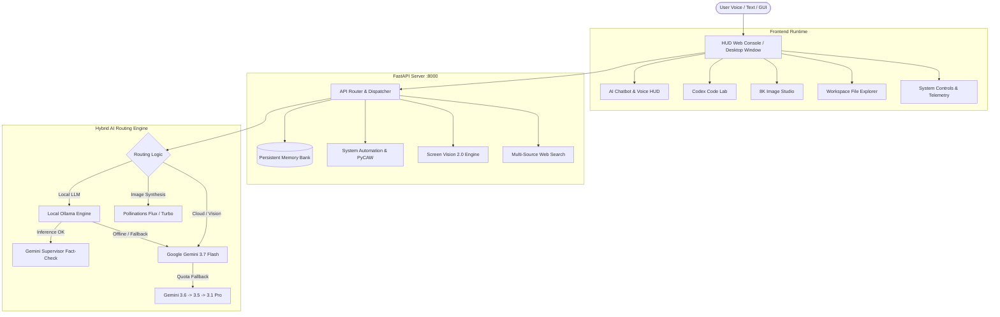

# ⚡ VEDAS AI 3.7 PRO — Autonomous Multimodal Neural Workstation & Voice Assistant

<div align="center">

[](https://github.com/Vfy123/VEDAS---AI---Voice-Assistant)
[](https://www.python.org/)
[](https://fastapi.tiangolo.com/)
[](https://ollama.com/)
[](https://ai.google.dev/)
[]()
[](LICENSE)

<p align="center">
  <strong>VEDAS AI 3.7 Pro</strong> is a state-of-the-art, local-first multimodal AI workstation, autonomous desktop command center, and voice assistant. Built with a dual-engine hybrid pipeline combining private local LLMs (via <strong>Ollama</strong>) and cloud reasoning (via <strong>Google Gemini 3.7 Flash</strong>), Screen Vision 2.0, Codex Code Lab, layout-aware PDF analysis, neural 8K image synthesis, live multi-engine web search, and native OS automation.
</p>

[✨ Key Features](#-key-features) • [🏗️ Architecture](#️-system-architecture) • [🚀 Quick Start](#-quick-start) • [🖥️ Standalone App](#️-standalone-desktop-app-mode) • [📦 Ollama Setup](#-local-llm-setup-ollama) • [🗣️ System Commands](#️-voice--system-commands) • [🔌 API Reference](#-api-endpoints-reference) • [🛠️ Tech Stack](#️-technology-stack)

---

</div>

## ✨ Key Features

### 🧠 Dual-Engine Hybrid Intelligence
- **Private Offline Inference**: Run private, 100% local LLMs (**LLaMA 3.2, Qwen 2.5, Phi-4, Mistral**) via Ollama as your primary engine with automatic background daemon management and VRAM pre-warming.
- **High-Speed Cloud Reasoning**: Seamless fallback to **Google Gemini 3.7 Flash / 3.6 Flash / 3.5 Flash / 3.1 Pro** when complex multi-modal analysis or cloud scaling is required.
- **Gemini Supervisor Fact-Checking**: Non-blocking real-time fact checker that validates local LLM responses in the background to detect hallucinations and provide instant corrections.

### 👁️ Screen Vision 2.0 & Optical Multimodal Studio
- **Hardware-Accelerated Screen Capture**: Ultra-fast (20ms) screen grab engine leveraging `mss` and Windows GDI `BitBlt` with `CAPTUREBLT` for hardware-accelerated, layered, and multi-monitor setups.
- **Real-Time Desktop Analysis**: Ask Vedas to analyze your active IDE, debug errors on screen, read charts, or summarize documents currently displayed.
- **Layout-Aware PDF Parser**: Extracts text while preserving column alignment, mathematical exercises, question numbers, and tables for instant problem solving.
- **Multimodal Visual Input**: Drag and drop images, screenshots, and diagrams for immediate visual comprehension.

### 💻 Codex Code Lab
- **Static & Neural Code Diagnosis**: Instant syntax validation via Python AST analysis coupled with deep neural diagnostics across Python, JavaScript, TypeScript, C++, Rust, Go, and more.
- **Autonomous Code Repair**: One-click code refactoring and bug resolution with structured explanations.
- **Secure Code Sandbox**: Execute Python scripts locally with real-time stdout/stderr capture, execution duration telemetry, and timeout safeguards.

### 🎨 8K Neural Image Studio
- **Pollinations Flux & Turbo Engines**: High-resolution image synthesis with zero API key requirement.
- **8 Artistic Style Presets**: *Cinematic, Anime (Makoto Shinkai), Cyberpunk 2077, Photorealistic 8K, 3D Render (Pixar style), Digital Art, Oil Painting, and Pixel Art*.
- **Custom Aspect Ratios & Seed Control**: Native support for `1:1`, `16:9`, `9:16`, `4:3`, and `3:2` dimensions with deterministic seed reproducibility.

### ⚡ Native OS & System Automation
- **Audio Control**: Precise master volume adjustment (`set volume to 75%`, `volume up/down`) and mute toggling via Windows PyCAW and Linux ALSA/PulseAudio.
- **Power Management**: Timed shutdown, reboot, sleep/suspend with 5-second countdown timers and instant abort (`cancel shutdown`).
- **Workstation Security**: Instant screen lock (`lock computer`).
- **Application Launcher**: Native launch triggers for Chrome, VS Code, Notepad, Calculator, Explorer, Spotify, Discord, VLC, Task Manager, and Settings.
- **Desktop File Operations**: Voice-controlled file and folder creation directly on your Desktop (`create folder Project Alpha`, `make a file notes.txt`).
- **Live System Telemetry**: Real-time CPU load, RAM utilization (GB used / total), platform details, and live time updates.

### 🔍 Multi-Source Live Web & Knowledge Engine
- **Sub-Second Live Search**: Instant zero-quota web search aggregating Google Live News RSS, Wikipedia Search API, and DuckDuckGo Instant Answers.
- **Encyclopedic Summaries**: Direct Wikipedia lookup with concise summaries.

### 🧠 Persistent Memory Bank & Personas
- **Session History & Notes**: Automatically preserves conversation sessions and user-curated persistent notes in JSON storage.
- **Custom Personas**: Switch between specialized system personalities:
  - ⚡ **Master Vedas**: Direct, brilliant, highly capable assistant
  - 💻 **Cyber Coder**: Production-ready software engineer
  - 🔬 **Deep Thinker**: Analytical logic and multi-step reasoning
  - 🎨 **Creative Muse**: Imaginative concept designer and writer
  - 🎭 **Sarcastic Genius**: Witty, charming, sharp intellect

---

## 🏗️ System Architecture



---

## 📁 Repository Structure

```
VEDAS AI/
├── RUN FILES/                         # Platform quick launchers & compiler scripts
│   ├── Build Vedas EXE.bat            # Standalone PyInstaller compiler script
│   ├── Vedas Windows Run.bat          # Windows batch launcher (Auto venv & Ollama)
│   ├── Vedas Windows Run.ps1          # Windows PowerShell launcher
│   ├── Vedas Linux Run.sh             # Linux bash launcher
│   └── Vedas Mac Run.command          # macOS launcher command
├── SERVER/                            # Core backend architecture
│   ├── vedas_server.py                # FastAPI server, endpoints, AI engines & OS control
│   └── run_vedas_web.py               # Web runtime orchestrator & browser launcher
├── static/                            # Frontend assets & web console
│   ├── index.html                     # Main Glassmorphic HUD interface
│   ├── widget.html                    # Floating desktop capsule assistant
│   ├── css/
│   │   └── style.css                  # HUD styling, animations, scanlines & neon glow
│   └── js/
│       ├── app.js                     # State management, API sync & UI handlers
│       └── particles.js               # Canvas particle background & audio visualizer
├── memory/                            # Persistent JSON memory store & chat sessions
│   └── memory.json                    # Saved notes and session histories
├── uploads/                           # Storage for uploaded PDFs, images, and documents
├── config.json                        # Workstation configuration & model preferences
├── requirements.txt                   # Complete Python dependencies specification
├── run_vedas_desktop.py               # Standalone Chromium App Runtime launcher
├── VedasAI.spec                       # PyInstaller build specification
├── LICENSE                            # MIT Open Source License
└── README.md                          # Project documentation
```

---

## 🚀 Quick Start

### 1. Prerequisites
- **Python 3.10+** installed ([Download Python](https://www.python.org/downloads/))
- **Ollama** installed for private local inference ([Download Ollama](https://ollama.com/))
- **Google Chrome** or **Microsoft Edge** (for standalone desktop app mode)

### 2. Clone the Repository
```bash
git clone https://github.com/Vfy123/VEDAS---AI---Voice-Assistant.git
cd "VEDAS AI"
```

### 3. Create & Activate Virtual Environment
```bash
# Windows (PowerShell / Command Prompt)
python -m venv venv
venv\Scripts\activate

# Linux / macOS
python3 -m venv venv
source venv/bin/activate
```

### 4. Install Dependencies
```bash
pip install -r requirements.txt
```

### 5. Configure Settings (Optional)
Edit `config.json` to customize your preferences:
```json
{
  "local_model": "llama3.2:latest",
  "cloud_model": "gemini-3.7-flash",
  "gemini_api_key": "YOUR_GEMINI_API_KEY_HERE",
  "ollama_host": "http://127.0.0.1:11434",
  "speech_rate": 1.0,
  "speech_pitch": 1.0,
  "tts_engine": "webspeech",
  "wake_word_enabled": true,
  "supervisor_enabled": true,
  "temperature": 0.7,
  "system_persona": "master_vedas"
}
```
> [!NOTE]
> Vedas AI includes built-in fallback Gemini access for quick evaluation, but adding your own free API key from [Google AI Studio](https://aistudio.google.com/) is recommended for dedicated quota.

---

## 🖥️ Standalone Desktop App Mode

Vedas AI runs as a native desktop application with zero browser clutter (no URL bar, no tabs, no browser chrome):

```bash
python run_vedas_desktop.py
```

### Quick Launchers
- **Windows**: Double-click `RUN FILES/Vedas Windows Run.bat`
- **Linux**: Run `bash "RUN FILES/Vedas Linux Run.sh"`
- **macOS**: Double-click `"RUN FILES/Vedas Mac Run.command"`

### Web Browser Mode
If you prefer running in your standard browser:
```bash
python SERVER/vedas_server.py
```
Open **`http://127.0.0.1:8000`** in any modern web browser.

---

## 📦 Local LLM Setup (Ollama)

For 100% private, offline AI execution:

1. Install [Ollama](https://ollama.com/).
2. Pull the default recommended model:
   ```bash
   ollama run llama3.2
   ```
3. *(Optional)* Pull additional high-performance models:
   ```bash
   ollama pull qwen2.5:7b
   ollama pull phi4
   ollama pull llama3:latest
   ```
4. Vedas AI automatically detects running Ollama instances on `http://127.0.0.1:11434` and pre-warms the model into VRAM on startup for zero cold-start delay.

---

## 🗣️ Voice & System Commands

Speak naturally through your microphone or type commands directly into the prompt:

| Category | Example Voice / Text Command | Action Performed |
| :--- | :--- | :--- |
| **Live Search** | `search for latest artificial intelligence breakthroughs` | Real-time web search with citations |
| **Knowledge** | `wikipedia Quantum Computing` | Concise encyclopedic lookup |
| **Volume Control**| `set volume to 80` or `volume up` / `volume down` | Adjusts master system audio level |
| **Audio Mute** | `mute audio` or `unmute` | Toggles system sound mute |
| **Desktop Ops** | `create folder DeepLearning` | Creates folder on your Desktop |
| **Desktop Ops** | `make a file todo.txt` | Generates a new text file on Desktop |
| **Workstation** | `lock computer` | Instantly locks OS workstation session |
| **Screen Vision**| `look at my screen and find the bug` | Captures screen & runs multimodal diagnosis |
| **App Launch** | `open chrome` / `launch notepad` / `start calculator` | Launches native desktop applications |
| **Power Control**| `shutdown` / `restart` / `sleep` | Initiates safe 5-second countdown |
| **Cancel Power** | `cancel shutdown` | Aborts pending shutdown timer |
| **Humor** | `tell me a joke` | Generates programming or general humor |

---

## 🔌 API Endpoints Reference

Vedas AI exposes a complete RESTful API powered by FastAPI:

| Endpoint | Method | Request Payload | Description |
| :--- | :---: | :--- | :--- |
| `/api/system/status` | `GET` | — | Real-time CPU, RAM, Ollama status, active models & platform |
| `/api/ollama/start` | `POST` | — | Verifies and auto-starts local Ollama background daemon |
| `/api/config` | `GET` / `POST` | `Dict[str, Any]` | Read or update configuration options |
| `/api/chat` | `POST` | `ChatRequest` | Main multimodal chat (Ollama + Gemini + Supervisor) |
| `/api/screen-vision` | `POST` | `ScreenVisionRequest` | Captures active screen and performs multimodal diagnosis |
| `/api/generate-image`| `POST` | `ImageGenRequest` | Generates high-res image via Pollinations Flux/Turbo |
| `/api/upload` | `POST` | `multipart/form-data` | Uploads & parses PDFs (layout mode), images, code, text |
| `/api/execute-code` | `POST` | `CodeExecRequest` | Executes Python code in local sandbox with stdout/stderr |
| `/api/codex/check` | `POST` | `CodexCheckRequest` | Static AST analysis + neural vulnerability check |
| `/api/codex/fix` | `POST` | `CodexFixRequest` | Autonomous code refactoring & bug repair |
| `/api/search` | `POST` | `SearchQueryRequest` | Live web search (Google News RSS + Wiki + DDG) |
| `/api/system/command`| `POST` | `SystemCommandRequest`| Executes OS actions (volume, power, apps, files) |
| `/api/files/browse` | `POST` | `FileBrowseRequest` | Interactive directory tree navigation |
| `/api/files/read` | `GET` | `?path=...` | Reads text/code file (<2MB) |
| `/api/files/write` | `POST` | `FileEditRequest` | Saves code or text edits to local file |
| `/api/files/create` | `POST` | `CreateItemRequest` | Creates new file or folder |
| `/api/files/rename` | `POST` | `RenameRequest` | Renames specified file or folder |
| `/api/files/delete` | `DELETE`| `?path=...` | Safely removes specified file or folder |
| `/api/memory` | `GET` | — | Retrieves all stored notes and chat sessions |
| `/api/memory/notes` | `POST` | `NoteRequest` | Adds persistent note to Memory Bank |
| `/api/memory/notes/{i}`| `DELETE`| — | Deletes a note by index |
| `/api/sessions` | `POST` | `Dict[str, Any]` | Saves or updates a chat session |
| `/api/sessions/{id}`| `DELETE`| — | Deletes a chat session |

---

## 🔨 Building Standalone Executable (.exe)

Compile Vedas AI into a zero-dependency standalone binary for distribution:

```bash
# Windows
"RUN FILES\Build Vedas EXE.bat"
```
Or directly via PyInstaller:
```bash
pyinstaller --noconfirm --clean VedasAI.spec
```
The compiled binary will be located in `dist/VedasAI.exe` with persistent memory configured in `dist/memory/`.

---

## 🛠️ Technology Stack

| Layer | Technologies |
| :--- | :--- |
| **Backend Framework** | [FastAPI](https://fastapi.tiangolo.com/), [Uvicorn](https://www.uvicorn.org/), [Pydantic v2](https://docs.pydantic.dev/) |
| **Local AI Engine** | [Ollama](https://ollama.com/) (LLaMA 3.2, Qwen 2.5, Phi-4) |
| **Cloud AI & Vision** | [Google GenAI SDK](https://github.com/google-gemini/generative-ai-python) (Gemini 3.7 Flash, 3.6, 3.5, 3.1 Pro) |
| **Image Generation** | [Pollinations AI](https://pollinations.ai/) (Flux & Turbo Models) |
| **Document Processing** | [pypdf](https://pypdf.readthedocs.io/) (Layout-Aware Mode), [Pillow](https://python-pillow.org/) |
| **Screen Capture** | `mss`, Windows GDI `BitBlt` with `CAPTUREBLT`, PIL `ImageGrab` |
| **Web & Live Search** | [duckduckgo-search](https://pypi.org/project/duckduckgo-search/), [wikipedia](https://pypi.org/project/wikipedia/), Google News RSS |
| **Audio & Automation** | [pycaw](https://github.com/AndreMiras/pycaw), [PyAutoGUI](https://pyautogui.readthedocs.io/), Web Speech API, [pyjokes](https://pypi.org/project/pyjokes/) |
| **Frontend UI** | Glassmorphic HUD, HTML5 Canvas Particles, Modern Vanilla CSS & JavaScript |
| **Runtime & Packaging** | Chromium App Mode, [PyInstaller](https://pyinstaller.org/) |

---

## 🤝 Contributing

Contributions, issues, and feature suggestions are welcome!

1. Fork the repository: [https://github.com/Vfy123/VEDAS---AI---Voice-Assistant](https://github.com/Vfy123/VEDAS---AI---Voice-Assistant)
2. Create your feature branch (`git checkout -b feature/NewFeature`)
3. Commit your changes (`git commit -m 'Add NewFeature'`)
4. Push to the branch (`git push origin feature/NewFeature`)
5. Open a Pull Request

---

## 📄 License

Distributed under the **MIT License**. See [`LICENSE`](LICENSE) for complete details.

<div align="center">
  <sub>Engineered with ⚡ by <a href="https://github.com/Vfy123">Vedansh (Vfy123)</a></sub>
</div>
