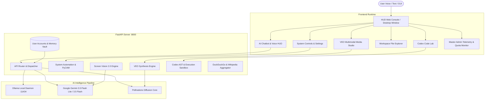

# ⚡ VEDAS AI 4.0 PRO — Autonomous Multimodal Neural Workstation & Voice Assistant

<div align="center">

[](https://github.com/Vfy123/VEDAS---AI---Voice-Assistant)
[](https://www.python.org/)
[](https://fastapi.tiangolo.com/)
[](https://ollama.com/)
[](https://ai.google.dev/)
[]()
[](LICENSE)

<p align="center">
  <strong>VEDAS AI 4.0 Pro</strong> is a state-of-the-art, local-first multimodal AI workstation, autonomous desktop command center, and voice assistant. Built with a dual-engine hybrid pipeline combining private local LLMs (via <strong>Ollama</strong>) and next-generation ultra-fast cloud reasoning (via <strong>Google Gemini 3.5 Flash Lite / 3.5 Flash / 3.7 Flash</strong>), Screen Vision 2.0, Codex Code Lab, VEO Media Studio, layout-aware PDF analysis, live telemetry quota monitoring, and native OS automation.
</p>

[✨ Key Features](#-key-features) • [🏗️ System Architecture](#️-system-architecture) • [🚀 Quick Start](#-quick-start) • [🖥️ Standalone Executable](#️-standalone-executable-mode-exe) • [🎬 VEO Media Studio](#-veo-multimodal-media-studio) • [🔒 Security & Admin](#-security--admin-portal) • [🔌 API Reference](#-api-endpoints-reference) • [🛠️ Tech Stack](#️-technology-stack) • [📄 License](#-license)

---

</div>

## ✨ Key Features

### 🧠 Dual-Engine Hybrid Intelligence
- **Private Offline Inference**: Run private, 100% local LLMs (**LLaMA 3.2, Qwen 2.5, Phi-4, Mistral, DeepSeek-R1**) via Ollama as your primary engine with automatic background daemon management and VRAM pre-warming.
- **Ultra-Fast Cloud Reasoning**: High-speed multimodal chain across **Google Gemini 3.5 Flash Lite, Gemini Flash Lite Latest, and Gemini 3.5 Flash** for near-instant responses (<2 seconds) on complex logic, mathematical synthesis, and vision tasks.
- **Supervisor Fact-Checking**: Non-blocking real-time fact checker that validates local LLM responses in the background to detect hallucinations and provide instant corrections.

### 📦 100% Self-Contained Standalone Executable
- **Single-File Binary (`VedasAI.exe`)**: Entire application compiled into a portable Windows executable with PyInstaller.
- **Embedded Data & Memory**: The UI frontend, backend API server, user credential vault (`user_accounts.json`), active auth sessions (`auth_sessions.json`), app configurations (`app_settings.json`), usage telemetry (`usage_stats.json`), and long-term conversation history (`memory.json`) are completely embedded inside the binary.
- **AppData Bootstrap Layer**: Automatically mounts persistent runtime data in `%LOCALAPPDATA%\VedasAI\memory` on launch so the `.exe` can be moved anywhere without external folder dependencies.

### 👁️ Screen Vision 2.0 & Multimodal Vision
- **Hardware-Accelerated Screen Capture**: Ultra-fast screen grab engine leveraging Windows GDI `BitBlt` with `CAPTUREBLT` for hardware-accelerated, layered, and multi-monitor setups.
- **Optimized Multimodal Processing**: Automatic high-efficiency thumbnail downscaling (1280x720) for images and screen vision frames, delivering rapid visual comprehension.
- **Layout-Aware PDF Parser**: Extracts text while preserving column alignment, mathematical exercises, question numbers, and tables for instant problem solving.
- **Multimodal Visual Input**: Drag and drop images, screenshots, and diagrams for immediate visual comprehension.

### 🎬 VEO Multimodal Media Studio
- **AI Image Generation**: High-resolution 8K text-to-image synthesis with prompt enhancement, negative prompts, custom aspect ratios (`1:1`, `16:9`, `9:16`, `4:3`), randomized seeds, and 8 artistic presets. One-click export to PNG, direct transfer to Image Editor, or reference attachment to Video Generator.
- **AI Video Generation**: Text-to-Video and Image-to-Video motion synthesis with customizable duration, FPS, and camera motion presets (*360° Orbit, Cinematic Push-In, Dolly Pan, Crane Up, Dynamic Drift*).
- **Interactive Cinematic Video Player**: Powered by a custom real-time canvas motion engine with scrubber timeline, custom play/pause, speed controls (`0.5x`, `1.0x`, `1.5x`, `2.0x`), looping, fullscreen, and native `.mp4` / `.webm` downloads.
- **Full Canvas Image Editing Studio**: Interactive HTML5 canvas with real-time sliders (*brightness, contrast, saturation, blur, hue*), filter checkboxes (*grayscale, invert, sepia*), preset filters (*Cyber Neon, HDR Crystal, Noir Cinema, Vintage Retro, Infrared*), drawing tools (*brush & eraser with size and color pickers*), aspect ratio cropping, text overlay banners, and AI Neural Remix.
- **Video Post-Production & FX**: Timeline trimming with live duration calculation, video speed multipliers (`0.25x` to `3.0x`), cinematic video filters, watermark text banners, audio mute/unmute toggle, frame snapshot to Image Editor, and video export.

### 💻 Codex Code Lab
- **Static & Neural Code Diagnosis**: Instant syntax validation via Python AST analysis coupled with deep neural diagnostics across Python, JavaScript, TypeScript, C++, Rust, Go, and more.
- **Autonomous Code Repair**: One-click AI code refactoring and bug resolution with structured explanation diffs.
- **Secure Code Sandbox**: Execute scripts locally with real-time stdout/stderr capture, execution duration telemetry, and timeout safeguards.

### 🔒 Security & Admin Portal
- **Locked Master Admin Portal**: Dedicated telemetry and quota control portal strictly restricted to authorized admin accounts. Completely invisible and blocked (403 Forbidden) for non-admin accounts.
- **Live Quota & Usage Monitor**: Real-time progress monitors for Gemini API tokens, remaining daily requests, local Ollama VRAM allocation, context window capacity, request latency, and media synthesis statistics with 4-second live auto-polling.
- **Credential Vault**: Saves verified accounts in `memory/user_accounts.json` enabling seamless sign-in with Google account credentials or custom password pairs.
- **Guest Access Guard**: Unauthenticated guest users are isolated with privacy guards preventing unauthorized access to `memory.json`.

### ⚡ Native OS & System Automation
- **Audio Control**: Precise master volume adjustment (`set volume to 75%`, `volume up/down`) and mute toggling via Windows PyCAW and Linux ALSA/PulseAudio.
- **Power Management**: Timed shutdown, reboot, sleep/suspend with 5-second countdown timers and instant abort.
- **Workstation Security**: Instant screen lock (`lock computer`).
- **Application Launcher**: Native launch triggers for Chrome, VS Code, Notepad, Calculator, Explorer, Spotify, Discord, VLC, Task Manager, and Settings.
- **Desktop File Operations**: Voice-controlled file and folder creation directly on your Desktop (`create folder Project Alpha`, `make a file notes.txt`).
- **Live System Telemetry**: Real-time CPU load, RAM utilization (GB used / total), platform details, and live time updates.

---

## 🏗️ System Architecture


```mermaid
graph TD
    User([User Voice / Text / GUI]) --> UI[HUD Web Console / Desktop Window]
    
    subgraph Frontend Runtime
        UI --> ChatUI[AI Chatbot & Voice HUD]
        UI --> VEOUI[VEO Multimodal Media Studio]
        UI --> CodexUI[Codex Code Lab]
        UI --> FileUI[Workspace File Explorer]
        UI --> SysUI[System Controls & Settings]
        UI --> AdminUI[Master Admin Telemetry & Quota Monitor]
    end

    subgraph Backend Core [FastAPI Server :8000]
        Router[API Router & Dispatcher]
        Mem[(User Accounts & Memory Vault)]
        AutoOS[System Automation & PyCAW]
        ScreenEngine[Screen Vision 2.0 Engine]
        VEOCore[VEO Synthesis Engine]
        CodexCore[Codex AST & Execution Sandbox]
        WebSearchEngine[DuckDuckGo & Wikipedia Aggregator]
    end

    subgraph AI Intelligence Pipeline
        Router --> PrimaryLLM[Ollama Local Daemon :11434]
        Router --> CloudLLM[Google Gemini 3.5 Flash Lite / 3.5 Flash]
        Router --> Pollinations[Pollinations Diffusion Core]
    end

    ChatUI --> Router
    VEOUI --> VEOCore
    CodexUI --> CodexCore
    SysUI --> AutoOS
    ScreenEngine --> CloudLLM
    VEOCore --> Pollinations
    Mem --> Router
```

---

## 🚀 Quick Start

### 1. Clone Repository & Install Dependencies
```bash
git clone https://github.com/Vfy123/VEDAS---AI---Voice-Assistant.git
cd "VEDAS AI"

# Install Python requirements
python -m pip install --upgrade pip
pip install -r requirements.txt
```

### 2. Configure Settings (Optional)
Application settings and API keys are stored in `memory/app_settings.json`:
```json
{
  "local_model": "llama3.2:latest",
  "cloud_model": "gemini-3.5-flash-lite",
  "gemini_api_key": "YOUR_GEMINI_API_KEY",
  "ollama_host": "http://127.0.0.1:11434",
  "speech_rate": 1.0,
  "speech_pitch": 1.0,
  "tts_engine": "webspeech"
}
```

### 3. Launch VEDAS AI
- **Desktop Window Mode (Recommended)**:
  ```bash
  python run_vedas_desktop.py
  ```
- **Web Server Only Mode**:
  ```bash
  python SERVER/vedas_server.py
  ```
  Open your browser and navigate to `http://127.0.0.1:8000`.

---

## 🖥️ Standalone Executable Mode (`.exe`)

VEDAS AI can be run as a 100% standalone single-file Windows executable with all assets, modules, and memory embedded:

- **Launch Executable Directly**: Run `dist/VedasAI.exe`
- **Recompile Executable**:
  ```bat
  "RUN FILES\Build Vedas EXE.bat"
  ```
  *The compiler utilizes `VedasAI.spec` to bundle the backend, frontend, default seed memory, and runtime hooks into a single portable binary.*

### Platform Launch Scripts (`RUN FILES/`):
- **Windows Standalone Launcher**: Double-click `RUN FILES/Vedas Windows Run.bat` or `RUN FILES/Vedas Windows Run.ps1`
- **Linux Launcher**: Execute `bash "RUN FILES/Vedas Linux Run.sh"`
- **macOS Launcher**: Execute `bash "RUN FILES/Vedas Mac Run.command"`

---

## 🎬 VEO Multimodal Media Studio

| Tab | Capability | Supported Features |
|---|---|---|
| **AI Image Gen** | Text-to-8K Visuals | Diffusion prompt presets, seed randomization, negative prompts, custom aspect ratios (`1:1`, `16:9`, `9:16`, `4:3`), instant download, one-click send to Editor or Video Gen. |
| **AI Video Gen** | Text & Image to Video | Camera motion presets (360° Orbit, Zoom-In, Pan, Crane Up), FPS & duration control, motion intensity, interactive playback engine. |
| **Image Editor** | Canvas Filter & Inpainting | Adjustments (Brightness, Contrast, Saturation, Blur, Hue, Grayscale, Invert, Sepia), 8 preset filters, freehand brush drawing & erasing, aspect ratio crop, cyber text overlays, AI Neural Remix. |
| **Video Editor** | Post-Production & FX | Video file upload or direct transfer, timeline start/end trimming, playback speed (`0.25x` to `3.0x`), video filters, watermark text banners, audio mute toggle, frame snapshot to Image Editor, MP4 export. |

---

## 🔒 Security & Admin Portal

- **Admin Portal Access**:
  - Secure master admin dashboard for monitoring telemetry, API quotas, and system diagnostics.
  - Restricted to authorized administrator credentials configured in `memory/user_accounts.json`.
- **Security Protections**:
  - Admin telemetry view (`#view-admin`) is hidden for all non-admin sessions.
  - Endpoints `/api/admin/usage`, `/api/admin/reset-usage`, `/api/admin/test-model` return `403 Forbidden` for non-admin tokens.
  - Guest users are restricted from accessing personal memory banks (`/api/memory`).
  - Google Account authorization securely vaults credentials into `memory/user_accounts.json`.

---

## 🔌 API Endpoints Reference

### Core AI & Chat
- `POST /api/chat` — Multimodal conversational inference with session persistence.
- `POST /api/screen-vision` — High-speed optical screen capture & vision reasoning.
- `POST /api/upload` — Multipart document and media upload (PDF layout parsing, image ingest).
- `POST /api/search` — Real-time live multi-source web search aggregator.

### VEO Media Studio
- `POST /api/veo/image-generate` — Synthesize 8K images with style and aspect ratio parameters.
- `POST /api/veo/image-edit` — Canvas modifications, preset filters, and AI Neural Remix.
- `POST /api/veo/video-generate` — Cinematic motion video synthesis.
- `POST /api/veo/video-edit` — Video timeline trim, speed modification, color filters, and watermark overlay.

### Codex Code Lab
- `POST /api/execute-code` — Secure multi-language local sandbox code execution.
- `POST /api/codex/check` — AST syntax & vulnerability diagnostic analysis.
- `POST /api/codex/fix` — AI automated code repair and refactoring engine.

### User Authentication & Memory
- `POST /api/auth/login` — Authenticate user credentials.
- `POST /api/auth/google` — Register & authorize Google credentials into user vault.
- `GET /api/auth/session` — Validate active session token.
- `POST /api/auth/logout` — Revoke session token.
- `GET /api/memory` — Retrieve neural memory notes (Requires authentication).
- `POST /api/memory/notes` — Save new custom memory note.
- `DELETE /api/memory/notes/{index}` — Delete specific memory note.

### Admin & System Telemetry
- `GET /api/admin/usage` — Master Admin quota, remaining requests, VRAM, and system metrics.
- `POST /api/admin/reset-usage` — Reset quota and model usage telemetry counters.
- `POST /api/admin/test-model` — Ping latency and health test for Gemini / Ollama.
- `POST /api/system/command` — Execute native OS automation commands.
- `POST /api/files/browse` — Browse local workspace directory structure.
- `GET /api/files/read` — Read local file contents into Codex.
- `POST /api/files/write` — In-place local file write.

---

## 🛠️ Technology Stack

- **Backend**: Python 3.11, FastAPI, Uvicorn, Pydantic, Requests, PyCAW, `mss`, `pypdf`, `duckduckgo_search`, `wikipedia`.
- **Frontend**: Vanilla HTML5, High-Performance Canvas 2D, Vanilla CSS (Glassmorphism & Cyber Glow Themes), Pure Vanilla JavaScript (ES6+).
- **Local AI Engine**: Ollama (LLaMA 3.2, DeepSeek-R1, Qwen 2.5, Phi-4).
- **Cloud AI Engine**: Google GenAI SDK (Gemini 3.5 Flash Lite, Gemini 3.5 Flash, Gemini 3.7 Flash).
- **Media Synthesis**: Pollinations Neural Diffusion Engine + HTML5 MediaRecorder.
- **Packaging**: PyInstaller standalone Windows executable packager.

---

## 📄 License

Distributed under the **MIT License**. See [LICENSE](LICENSE) for more information.

<div align="center">
  <sub>Built with ❤️ by <strong>Vedansh Ghanekar</strong> • Powered by Google Gemini & Ollama</sub>
</div>
